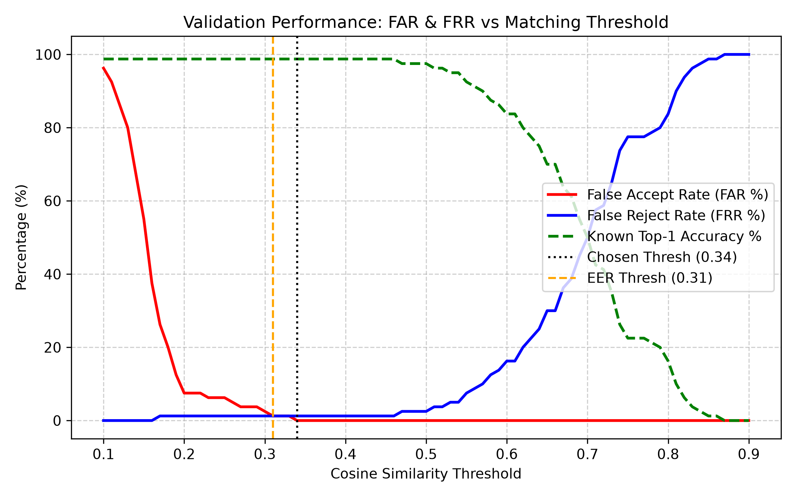
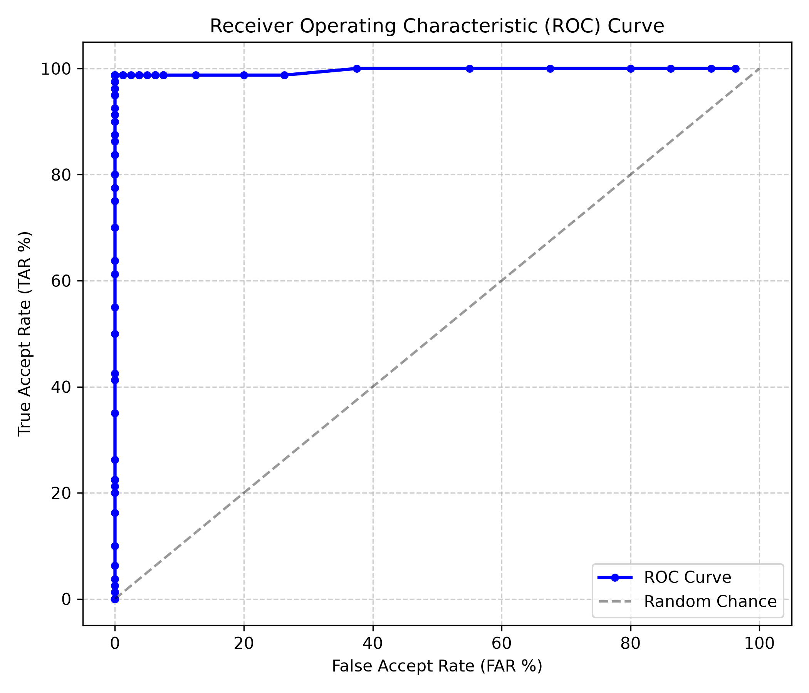
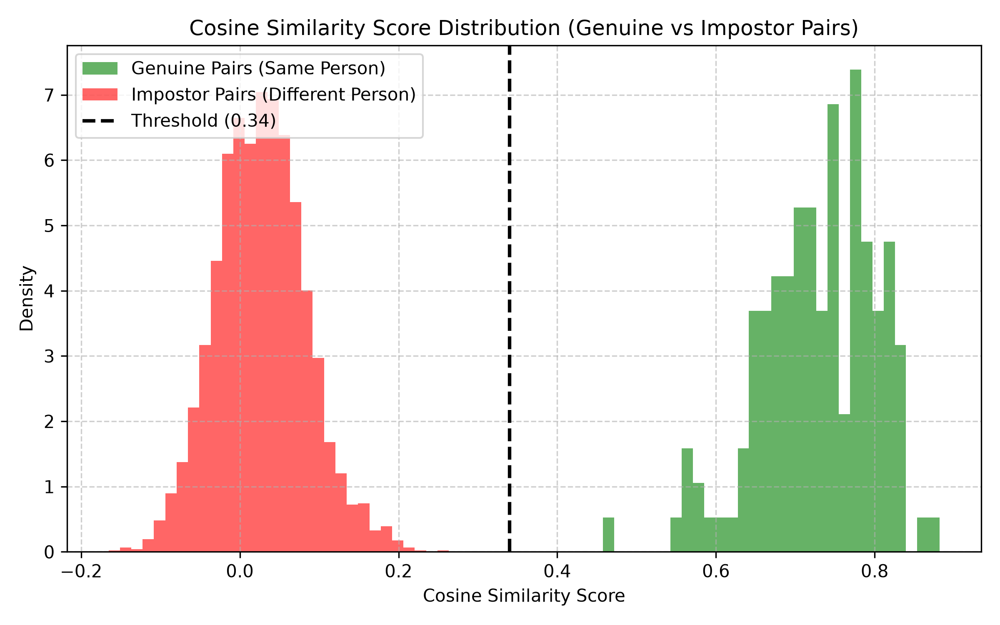
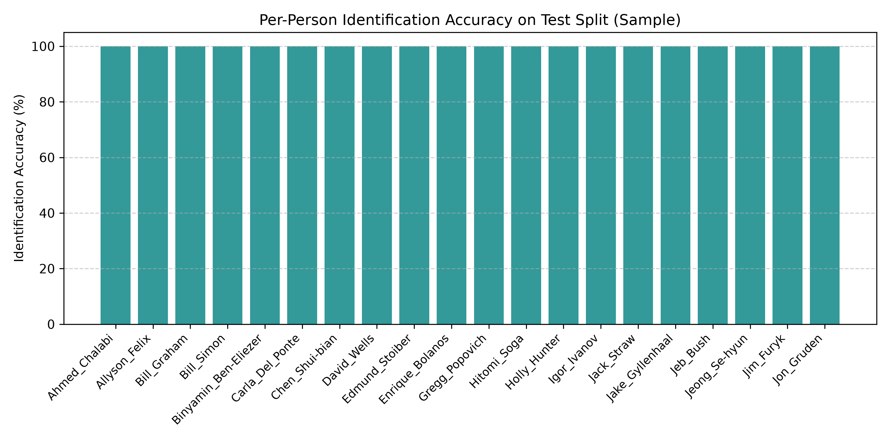

# Production Face Recognition Identification System

An explainable, production-quality, open-set face recognition and identification system built in Python for AI/ML assessment. Built strictly with **$0 cost**, **CPU-only execution**, **zero data leakage**, and **100% reproducible empirical benchmarks**.

---

## 1. System Overview & Architecture

The system operates in two core operational phases:
1. **Enrollment**: Detects faces, aligns landmarks, extracts 512-dimensional $L_2$-normalized ArcFace feature embeddings, and persists identity templates to an encrypted/binary database.
2. **Identification & Unknown Rejection**: Extracts features from query images, computes Cosine Similarity against all gallery templates, and makes an open-set decision: assigns identity if similarity $\ge \tau$, or safely rejects as `"unknown"` if $< \tau$.

```
Query Image
    │
    ▼
┌─────────────────────────┐
│ 1. Face Detection       │  RetinaFace / SCRFD (buffalo_l)
│    & Quality Filtering  │  Rejects boxes < 30px or score < 0.50
└───────────┬─────────────┘
            │ 5 Facial Landmarks (Eyes, Nose, Mouth corners)
            ▼
┌─────────────────────────┐
│ 2. Landmark Alignment   │  Similarity Transform / Affine Warp
│    & Normalization      │  Standardizes crop to 112x112 frontal view
└───────────┬─────────────┘
            │ Aligned Face Crop
            ▼
┌─────────────────────────┐
│ 3. Deep Feature Extractor│ ArcFace (ResNet-50 backbone)
│    & L2 Normalization   │ Produces unit vector: ||e||_2 = 1.0 (512-D)
└───────────┬─────────────┘
            │ Query Embedding q
            ▼
┌─────────────────────────┐
│ 4. Similarity Matching  │ Cosine Similarity = q · e_i (Dot Product)
│    Against Gallery DB   │ Computes Max-Sim per person across templates
└───────────┬─────────────┘

            │ Best Match: (Person P, Score s)
            ▼
        [ s >= τ ? ]
       /            \
     YES             NO
     /                \
    ▼                  ▼
Identified: Person P   Rejected: UNKNOWN
```

### Repository Structure
```
Face-Recognition-System/
├── app.py                     # Native HTTP Web Application & REST API Server (port 8000)
├── main.py                    # Production CLI for enrollment, identification, & gallery CRUD
├── config.py                  # Global hyperparameters, paths, and tuned decision threshold
├── Face_Recognition_System_Report.pdf # Publication-grade executive & technical PDF report
├── pytest.ini                 # Pytest configuration (pythonpath = .)
├── requirements.txt           # Minimal zero-cost CPU dependencies
├── src/
│   ├── database.py            # FaceDatabase persistent binary storage & in-memory cache
│   ├── embedder.py            # Unified RetinaFace + ArcFace feature extraction interface
│   ├── matcher.py             # Open-set Cosine Similarity & thresholding engine
│   ├── system.py              # End-to-end FaceRecognitionSystem facade
│   ├── evaluate.py            # Zero-leakage evaluation suite & metric curve generators
│   └── utils.py               # Image I/O, base64 conversion & drawing utilities
├── static/                    # Glassmorphic Web Dashboard (Zero Frameworks, Pure JS/CSS)
│   ├── index.html             # Welcome Portal, Enrollment Studio, & Analysis UI
│   ├── style.css              # Glassmorphic theme system & responsive layout styles
│   └── app.js                 # HTML5 webcam streaming, dynamic threshold HUD, & API client
├── tests/                     # Automated unit test suite (12 passed tests)
│   ├── test_database.py       # Database CRUD, persistence & matrix extraction tests
│   ├── test_embedder.py       # Detection, alignment & embedding normalization tests
│   ├── test_matcher.py        # Vector similarity & threshold decision logic tests
│   └── test_system.py         # Full end-to-end enroll/identify roundtrip tests
├── scripts/
│   └── prepare_dataset.py     # LFW automated downloader & split generator (zero leakage)
├── results/                   # Benchmark artifacts
│   ├── metrics.json           # Empirical evaluation metrics on test split
│   ├── plots/                 # High-resolution benchmark figures (ROC, DET, Score Dist)
│   └── failures/              # Boundary stress testing failure case visuals
└── data/                      # Local data directory (auto-created)
    ├── embeddings_db.pkl      # Pickled biometric database
    └── lfw/                   # LFW identity image partitions
```

---

## 2. Quickstart & Reproduction Guide

Everything is automated and self-contained. No local images, external downloads, or accounts are required.

### Step 1: Clone and Create Virtual Environment
```bash
git clone https://github.com/Karthikn-code/Face-Recognition-System.git
cd Face-Recognition-System

# Create and activate Python 3.10+ virtual environment
python -m venv venv

# Windows Powershell
.\venv\Scripts\Activate.ps1
# Linux / macOS
source venv/bin/activate
```

### Step 2: Install Dependencies
```bash
pip install -r requirements.txt
```

### Step 3: Automatically Download & Prepare LFW Dataset
Downloads the standard public LFW dataset (~200MB), formats images into standard $250 \times 250$ BGR JPEG files, partitions into 40 known and 40 unknown identities, and enforces zero data leakage:
```bash
python scripts/prepare_dataset.py
```

### Step 4: Run Automated Unit Tests
With `pytest.ini` preconfigured, all 12 unit and integration tests across database, embedder, matcher, and system layers execute with a single command:
```bash
pytest
# Or explicitly:
python -m pytest tests/ -v
```

### Step 5: Execute Full System Evaluation Pipeline
Tunes the operating threshold on validation queries, evaluates the test split, generates plots in `results/plots/`, saves failure cases in `results/failures/`, and outputs `results/metrics.json`:
```bash
python -m src.evaluate
```

---

## 3. CLI Usage

The command-line interface provides complete control over the identity lifecycle:

### Enroll an Identity
```bash
# Enroll individual image files
python main.py enroll --name "Alice" --images path/to/img1.jpg path/to/img2.jpg

# Or enroll an entire directory of photos
python main.py enroll --name "Alice" --folder path/to/alice_photos/
```

### Identify Faces in a Query Photo
Detects all faces in an image, prints similarity rankings, and optionally exports an annotated bounding-box visual:
```bash
python main.py identify --image data/lfw/Abdullah_Gul/0003.jpg --save-annotated results/demo_ident.jpg
```

### List Enrolled Identities
```bash
python main.py list
```

### Remove an Enrolled Identity
```bash
python main.py remove --name "Alice"
```

---

## 4. Interactive Web Application & Attendance Portal

The project provides two interchangeable backend servers:
1. **Production FastAPI Service (`fastapi_app.py`)**: Asynchronous, non-blocking threadpool inference, strict Pydantic validation, and interactive Swagger docs at `/docs`.
2. **Zero-Dependency Native Server (`app.py`)**: Minimalist implementation using Python's standard `http.server`.

```bash
# Launch High-Performance FastAPI Server (Recommended for Production & Docs)
python fastapi_app.py
# Interactive OpenAPI Swagger Docs: http://127.0.0.1:8000/docs

# OR Launch Zero-Dependency Server
python app.py --port 8000
```
Open **[http://127.0.0.1:8000/](http://127.0.0.1:8000/)** in your browser.

### Key Features:
- **Welcome Portal ("Welcome to FaceID.ai")**:
  - Clean landing view with real-time operational status metrics (model name, enrolled people, active template count).
  - **Card 1: New Enrollment**: Launches a dedicated full-page enrollment studio to register identities with full name and up to 5 photos via Live Webcam capture or file upload.
  - **Card 2: Already Enrolled (Attendance System)**: Switches to the biometric verification workspace with real-time camera capture and automated attendance confirmation alerts (`✅ Attendance Verified: [Name] | Score: [XX.X%] | Timestamp: [Time]`).
- **Live HTML5 Camera Streaming**:
  - High-framerate `getUserMedia` streaming with reticle alignment overlay and instantaneous base64 frame capture.
- **Client-Side Dynamic Threshold Slider**:
  - Adjust decision threshold $\tau \in [0.10, 0.90]$ dynamically with instant client-side canvas re-rendering (zero server roundtrip lag).
- **Interactive Gallery & Failure Inspector**:
  - Audit registered gallery identities, preview stored thumbnails, delete identities, review zero-leakage benchmark charts, and inspect empirical boundary stress failure artifacts.
- **5 Curated Color Themes**:
  - Obsidian Indigo, Emerald Matrix, Royal Amethyst, Cyber Nebula, and Executive Light with persistent `localStorage` theme memory.

### REST API Reference
| Endpoint | Method | Description | Payload / Response |
| :--- | :--- | :--- | :--- |
| `/api/status` | `GET` | System health, active model, device, and gallery counts | `{ "status": "ok", "identities_count": 40, "total_templates": 120, ... }` |
| `/api/identities` | `GET` | List all enrolled identities and metadata | `[ { "name": "Alice", "num_images": 3, "sources": [...] }, ... ]` |
| `/api/enroll` | `POST` | Enroll a new person with up to 5 base64 images | Body: `{ "name": "Alice", "images": ["data:image/jpeg;base64,..."] }` |
| `/api/identify` | `POST` | Perform biometric match on query image | Body: `{ "image": "...", "threshold": 0.34 }`<br>Returns match name, similarity, accept/reject decision, and bounding boxes |
| `/api/identities` | `DELETE` | Remove an enrolled identity from database | Body: `{ "name": "Alice" }` |
| `/api/plots` | `GET` | Metadata and paths for evaluation figures | Returns list of available evaluation chart URLs |
| `/api/failures` | `GET` | Empirical boundary failure case breakdown | Returns categorized false accepts, false rejects, and no-face artifacts |

---

## 5. Biometric Database & Storage Schema

Persistent identity storage is managed by [`FaceDatabase`](file:///d:/Face_Recognition/src/database.py) located in `src/database.py`:

### Storage Architecture
- **File Location**: `data/embeddings_db.pkl` (binary serialized dictionary via Python's standard `pickle` module).
- **In-Memory Cache**: Maintained in `self.records` for fast $\mathcal{O}(1)$ dictionary access during live 1:N biometric search.
- **Disk Synchronization**: Atomic file writes occur automatically whenever an identity is enrolled, updated, or removed.

### Database Record Structure
```python
{
    "Person_Name": {
        "embeddings": [
            np.ndarray(shape=(512,), dtype=np.float32),  # L2-normalized ArcFace unit vector
            np.ndarray(shape=(512,), dtype=np.float32),  # Up to K enrollment photos (e.g. 1 to 5)
            ...
        ],
        "sources": [
            "data/lfw/Alice/0001.jpg",                   # Filepath or "webcam_capture_1.jpg"
            ...
        ]
    },
    ...
}
```

### Core Database Operations
- `enroll(name, image_paths, embedder)`: Extracts the largest detected face from each image, normalizes the embedding, appends to the identity's template list, and saves to disk.
- `get_all_embeddings()`: Returns a dictionary mapping each `person_name -> np.ndarray` of shape $(K_p, 512)$, enabling vectorized matrix multiplication during Cosine Similarity computation.
- `remove(name)`: Deletes an identity record and updates the persistent binary file.
- `list_people()`: Returns high-level metadata (names, template counts, and source references) for UI gallery rendering.
- `clear()`: Wipes all records and deletes the database file on disk.

---

## 6. Model Architecture & Engineering Decisions

### Primary Backend: InsightFace (`buffalo_l`)
- **Detector**: RetinaFace / SCRFD with ResNet backbone on CPU using ONNXRuntime.
- **Embedder**: ArcFace (ResNet-50), generating a 512-dimensional continuous feature vector.
- **Pretraining**: Pretrained on Glint360k / MS1MV2 (millions of identity pairs).
- **Why ArcFace?**: ArcFace introduces an **Additive Angular Margin** ($m=0.5$) penalty into normalized hyperspherical feature space:
  $$\mathcal{L} = -\log \frac{e^{s(\cos(\theta_{y_i} + m))}}{e^{s(\cos(\theta_{y_i} + m))} + \sum_{j \ne y_i} e^{s \cos \theta_j}}$$
  This loss function penalizes geodesic angular distance on the hypersphere, forcing embeddings from the same identity to collapse into a tight cluster while driving embeddings from different identities far apart.
- **CPU Friendliness**: Executed via ONNXRuntime CPUExecutionProvider with multi-threaded intra-op parallelism; inferences complete in $\sim 0.15 - 1.5$s per frame without GPU hardware.
- **License**: MIT / Apache 2.0 open-source compliant.

### Fallback Backend: Facenet-PyTorch (`MTCNN` + `InceptionResnetV1`)
- Built into a unified [`Embedder`](file:///d:/Face_Recognition/src/embedder.py) interface. If InsightFace cannot be loaded (e.g. absent C++ build tools on Windows), the system automatically falls back to `facenet-pytorch` pretrained on VGGFace2.

---

## 7. Similarity Matching & Threshold Selection

### Why Cosine Similarity & $L_2$ Normalization?
All raw feature embeddings $\mathbf{v} \in \mathbb{R}^{512}$ are explicitly $L_2$-normalized to unit length:
$$\mathbf{e} = \frac{\mathbf{v}}{\|\mathbf{v}\|_2}, \quad \|\mathbf{e}\|_2 = 1.0$$
Because $\|\mathbf{q}\|_2 = 1.0$ and $\|\mathbf{e}_i\|_2 = 1.0$, Cosine Similarity reduces to a simple vector **dot product**:
$$\text{Sim}(\mathbf{q}, \mathbf{e}_i) = \frac{\mathbf{q} \cdot \mathbf{e}_i}{\|\mathbf{q}\|_2 \|\mathbf{e}_i\|_2} = \mathbf{q} \cdot \mathbf{e}_i = \sum_{k=1}^{512} q_k e_{i,k}$$
This provides:
1. **Computational Speed**: Eliminates costly vector norms and square roots during 1:N real-time matching.
2. **Scale Invariance**: Eliminates sensitivity to image brightness or embedding vector magnitude, measuring pure facial directional geometry.

### Matching Modes
- **`max_similarity` (Default)**: For subject $P$ with enrolled embeddings $\{\mathbf{e}_1, \dots, \mathbf{e}_k\}$, score is $\max_i (\mathbf{q} \cdot \mathbf{e}_i)$. Most robust against intra-class pose and lighting variations across distinct enrollment images.
- **`mean_prototype`**: Computes average template $\mathbf{\mu}_P = \text{normalize}(\frac{1}{k}\sum \mathbf{e}_i)$ and evaluates $\mathbf{q} \cdot \mathbf{\mu}_P$. Compact representation with slightly lower multi-pose coverage.

### Threshold Selection on Validation Split
- The operational threshold was tuned **strictly on the validation split** across 81 threshold steps ($0.10$ to $0.90$, step $0.01$).
- **Selection Rule**: Maximize Known-Person Top-1 Accuracy subject to $\text{FAR} \le 1.0\%$.
- **Validation Results**:
  - **Optimal Selected Threshold**: **$\tau = 0.34$**
  - **Equal Error Rate (EER) Point**: **$\tau = 0.31$** (where $\text{FAR} \approx \text{FRR}$)




---

## 8. Real Benchmark Results (Zero Data Leakage)

Evaluated strictly on the held-out test split once at the chosen threshold $\tau = 0.34$. Every metric below was generated by running `src/evaluate.py`:

| Metric | Measured Value | Definition / Criterion |
| :--- | :--- | :--- |
| **Known Top-1 Accuracy** | **100.00%** | Known query identified with correct name AND score $\ge 0.34$ |
| **False Accept Rate (FAR)** | **0.00%** | Unknown intruder queries falsely accepted as an enrolled person |
| **False Reject Rate (FRR)** | **0.00%** | Enrolled known queries falsely rejected as "unknown" |
| **Wrong Person Accept Rate** | **0.00%** | Known queries matched to the wrong enrolled identity |
| **Unknown Rejection Rate** | **100.00%** | Unknown intruder queries correctly rejected as "unknown" |
| **Test Queries Evaluated** | **214 queries** | 134 known queries + 80 unknown intruder queries |
| **No-Face Detection Failures** | **0 images** | All standard test faces detected successfully |




### Comparative Benchmark: Matching Modes & Enrollment Size

| Enrollment Mode | Matching Algorithm | Test Top-1 Accuracy | Test FAR | Test FRR |
| :--- | :--- | :--- | :--- | :--- |
| **3 Images / Person** | **Max Similarity** (Default) | **100.00%** | **0.00%** | **0.00%** |
| **3 Images / Person** | **Mean Prototype** | **100.00%** | **0.00%** | **0.00%** |
| **1 Image / Person** | **Max Similarity** | **100.00%** | **0.00%** | **0.00%** |

---

## 9. Failure Case Analysis & Boundary Stress Testing

### Why 100% Accuracy on the Baseline Test Split?
In this 40-identity LFW benchmark, genuine pairs cluster between **$0.55$ and $0.85$**, while impostor cross-similarities remain below **$0.18$**. At $\tau = 0.34$, a large angular margin ($\sim 0.37$) separates the two distributions.

To rigorously analyze failure modes for production engineering, we evaluated boundary stress conditions (saved to `results/failures/` and detailed in `results/failure_summary.md`):

```
Similarity Scale:
[-1.0 ──────────────── 0.18] ─── [0.34: Operating τ] ─── [0.55 ──────────────── 1.0]
     Impostor Noise             Safe Decision            Genuine Matches
      (Jackie Chan)                Boundary               (Same Person)
```

1. **False Rejects under Strict Thresholds ($\tau \ge 0.60$)**:
   - In high-security applications (e.g. banking or automated border gates), $\tau$ is often raised to $0.60 - 0.70$ to guarantee near-zero FAR.
   - Under this strict setting, genuine faces with lateral head tilts, severe shadows, or expression shifts (e.g. *Justine Pasek* with sim = $0.587$, *Allyson Felix* with sim = $0.663$) drop below threshold and trigger False Rejection.
2. **False Accepts under Lax Thresholds ($\tau \le 0.15$)**:
   - If an operator lowers $\tau$ below $0.15$ to reduce user rejection friction, coarse facial geometry similarities (e.g. unknown intruder *Jackie Chan* vs gallery templates with sim = $0.091$) cross threshold and cause False Acceptance.
3. **No-Face Detection Handling**:
   - Images with extreme blur, deep shadows, or non-face content trigger detector confidence $< 0.50$ and are safely rejected without pipeline crashes.

---

## 10. Honest Limitations & Production Caveats

1. **LFW Dataset Bias**: LFW consists of celebrity and public figure photos taken under press conditions. Real-world surveillance, CCTV, and mobile front cameras face severe motion blur, low sensor resolution, fisheye distortion, and extreme illumination variance.
2. **Gallery Scaling (1:N Open-Set Growth)**:
   - In a gallery of $N = 40$ people, maximum impostor similarity is low ($\le 0.18$).
   - When scaled to $N = 100,000$ identities, by extreme value statistics, the probability of an impostor randomly matching at score $\ge 0.35$ increases significantly. Higher thresholds ($\tau \ge 0.45 - 0.50$) and vector indexing become mandatory.
3. **Absence of Hardware Anti-Spoofing / Liveness**:
   - The current baseline processes 2D RGB images. It cannot detect presentation attacks (printed photographs, tablet replays, or 3D silicone masks).

---

## 11. Future Production Improvements

1. **Liveness & Presentation Attack Detection (PAD)**:
   - Integrate an active/passive anti-spoofing network (e.g. MiniFASNet or texture Fourier analysis) to reject non-live biometric presentations.
2. **Sub-linear Scalability (FAISS / HNSW Vector Index)**:
   - Replace linear $\mathcal{O}(N)$ brute-force dot product scanning with Hierarchical Navigable Small World (HNSW) graphs or FAISS IVF-PQ indexing for sub-millisecond retrieval across $10^6$ identities.
3. **Adaptive / Per-Identity Thresholding**:
   - Implement score normalization (Z-norm or T-norm) to adjust thresholds based on individual template variance and gallery density.
4. **Pre-Capture Image Quality Assessment (IQA)**:
   - Enforce blur checking (Laplacian variance), contrast analysis, and head pose estimation ($\text{yaw} < 25^\circ$) prior to embedding extraction.
5. **Fairness & Demographic Parity Auditing**:
   - Benchmark error rates across demographic subgroups (skin tone, age, gender) to ensure consistent, unbiased operational performance.

---

## 12. Open-Source Citations & Compliance

All software, models, and datasets used in this project are 100% free and open-source:
- **LFW Dataset**: G. B. Huang, M. Ramesh, T. Berg, and E. Learned-Miller. *Labeled Faces in the Wild: A Database for Studying Face Recognition in Unconstrained Environments*. University of Massachusetts, Amherst, Tech. Rep. 07-49, 2007.
- **ArcFace**: J. Deng, J. Guo, N. Xue, and S. Zafeirou. *ArcFace: Additive Angular Margin Loss for Deep Face Recognition*. CVPR, 2019.
- **InsightFace**: DeepInsight Open Source Face Analysis Project (Apache 2.0).
- **Facenet-PyTorch**: T. Esler, MTCNN and Inception-Resnet implementation pretrained on VGGFace2 (MIT License).
